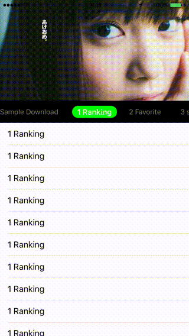
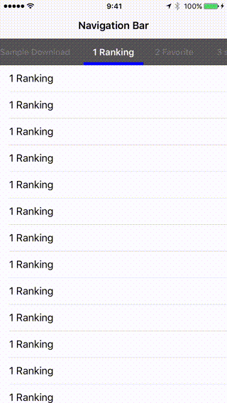

# ViewPagerController

[](https://developer.apple.com/swift/)
[](https://developer.apple.com/swift/)
[](https://developer.apple.com/swift/)





## Features

- Show header tab menu
- Infinite scroll header tab menu
- Infinite scroll contents view
- Can add header view
- Show header tab selected view (customizeable)
- Can scroll header view or navigation bar (customizeable)

## Demo

[See demo on Appetize.io](https://appetize.io/app/gbtduh7bghgt397t0e8hedd9wm?device=iphone5s&scale=75&orientation=portrait&osVersion=9.2)

## Requirements

* Xcode 7.2+
* iOS 8.0+
* Swift 2.1
* iPhone Portrait (iPad Not Supported)

## Installation

### CocoaPods

ViewPagerController is available through [CocoaPods](http://cocoapods.org). To install
it, simply add the following line to your Podfile:

```

platform :ios, '8.0'
use_frameworks!

pod "ViewPagerController"

```

### Carthage

To integrate ViewPagerController into your Xcode project using Carthage, specify it in your Cartfile:

```

github "xxxAIRINxxx/ViewPagerController"

```

## License

MIT license. See the LICENSE file for more info.
